author: Julián Mora
summary: Instalación Software para el curso
id: codelab-vivi-001
tags:
categories: Codelabs, Software
environments: Web
status: Draft
feedback link: https://github.com/julian27m/julian27m.github.io

# Instalación del software necesario

## 0. Resumen

Duration: 0:02:00

**POR FAVOR, ANTES DE INICIAR LA GUÍA DE INSTALACIÓN DE UNITY, INICIA UN TEMPORIZADOR PARA MEDIR EL TIEMPO QUE UTILICES HASTA TERMINAR EL PROCESO.**

¡Bienvenido al curso Desarrollo de Aplicaciones de Realidad Virtual para todos!
Esta guía te ayudará a familiarizarte con todos los programas necesarios para participar en el curso y te guiará paso a paso en su instalación. Sigue esta guía para configurar tu entorno de desarrollo.
¡Prepárate para sumergirte en el fascinante universo de la realidad virtual!

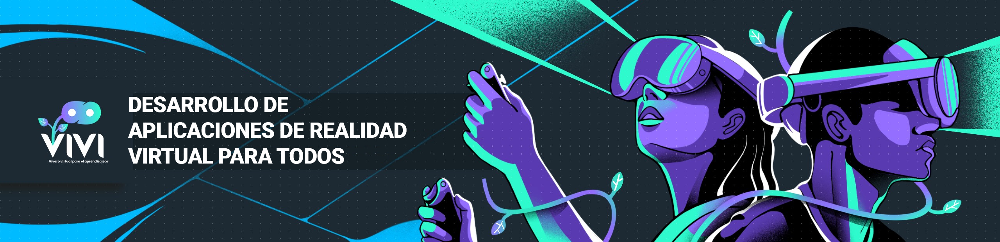

### Software a utilizar durante la guía

- [Unity](https://unity.com)
- [Visual Studio 2019+](https://visualstudio.microsoft.com/es/vs/community/)
- [OpenXR](https://www.khronos.org/openxr/)
- [Oculus (opcional)](https://www.meta.com/es-es/help/quest/articles/headsets-and-accessories/oculus-rift-s/install-app-for-link/)

> aside positive
> Todos los estudiantes que tengan una máquina virtual (MV) asignada para realizar este curso pueden omitir estas instalaciones, debido a que la MV ya cuenta con ellas. Para solitar acceso a una MV por favor siga el siguiente [enlace](https://www.ejemplo.com).

## 1. Unity Hub

Duration: 0:05:00

Unity es una poderosa plataforma de desarrollo de juegos y aplicaciones en 3D y 2D, ampliamente utilizada en la industria de los videojuegos, la simulación, la arquitectura y la realidad virtual, entre otros campos. Con Unity, los desarrolladores pueden crear experiencias interactivas y envolventes para una variedad de plataformas, incluidas PC, consolas, dispositivos móviles y realidad virtual.

Para instalar Unity, utilizaremos Unity Hub, que es un administrador de versiones y proyectos de Unity. Unity Hub nos permite administrar múltiples versiones de Unity, así como crear y abrir proyectos de manera fácil y conveniente. Dentro de Unity Hub, podemos instalar diferentes versiones de Unity Editor.

### Instalar Unity Hub

1. Puede instalar Unity Hub ingresando en la siguiente [página](https://unity.com/es/download).
   En este lugar podrá seleccionar y descargar la versión adecuada para su sistema operativo.

   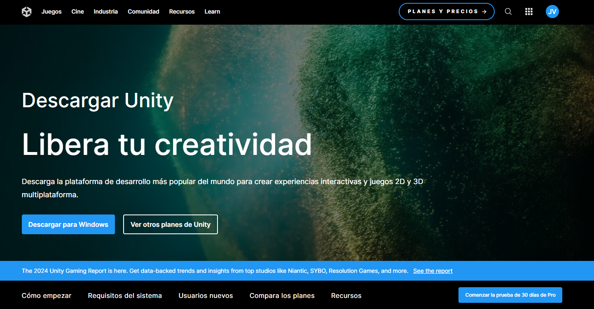
2. Al finalizar la descarga, diríjase a su carpeta de Descargas. Ahora, seleccione el archivo llamado UnityHubSetup, tal como se muestra en la siguiente imagen:

   
3. Al ejecutar el archivo, se desplegarán las instrucciones de instalación. Por favor, siga estos pasos hasta que el proceso se finalice.

   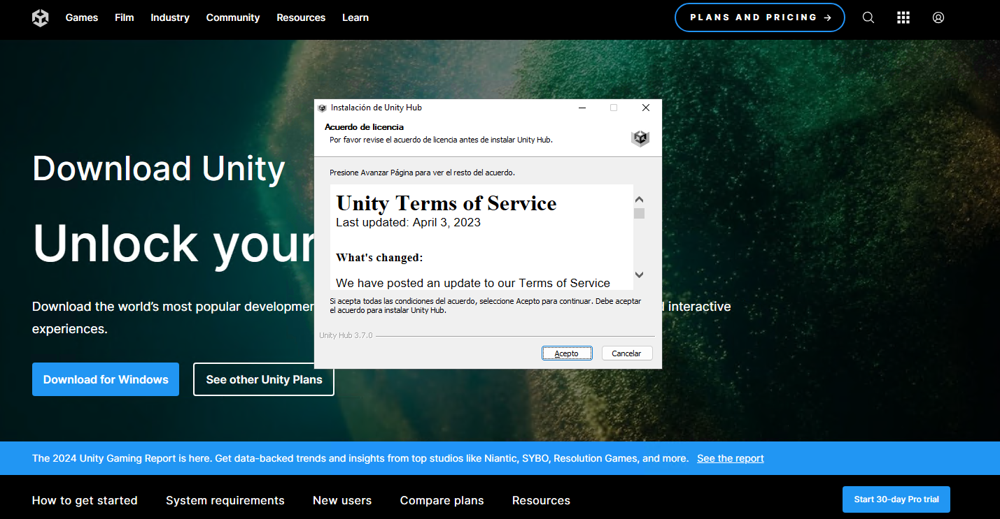
4. Al finalizar el proceso de instalación, se va a abrir una ventana de Unity. Dentro de esta ventana podrá iniciar sesión o crear una cuenta, en caso de no contar con una. Si ya tiene una cuenta, inice sesión y continue con el próximo módulo. Si por el contrario, desea crear una cuenta, siga los pasos a continuación.

   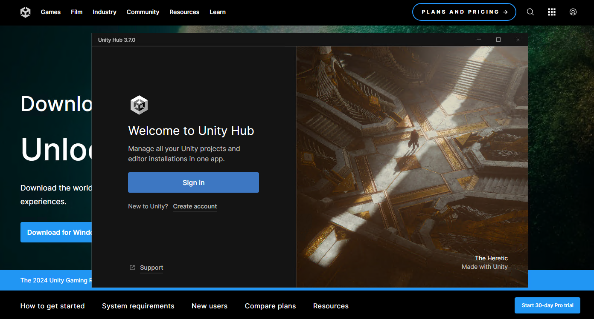

### Crear una cuenta

1. Seleccione la opción "Create account".
2. Se abrirá una pestaña en el navegador. Ingrese sus datos y cree su ID de Unity.

   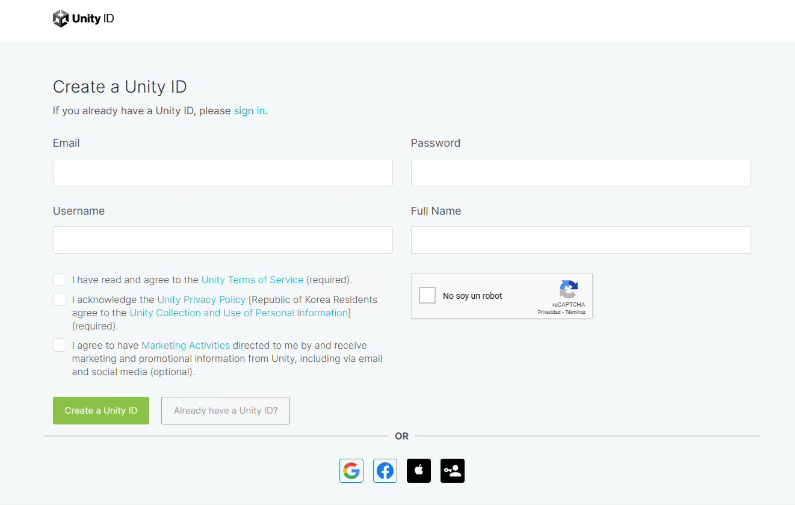
3. Después de crear el ID de Unity, le llegará a su correo un mensaje de confirmación.

   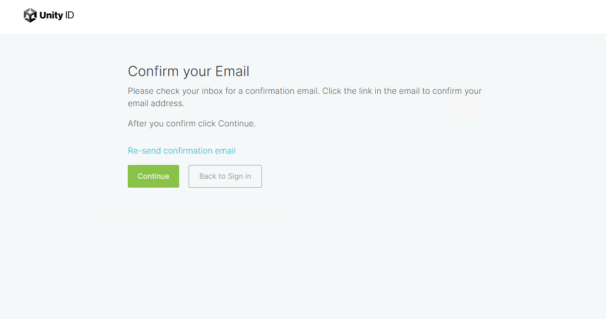

   Por favor, confirme su correo haciendo click en el enlace destacado.

   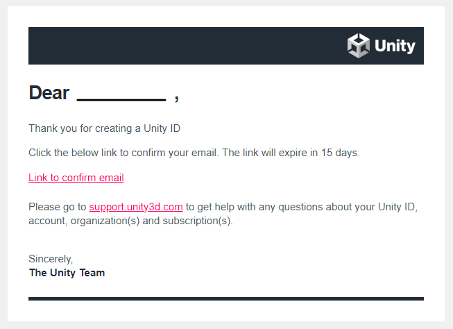
4. Vuelva a abrir Unity e inicie sesión.

¡Excelente! Ya cuenta con Unity Hub y una cuenta activa de Unity. Antes de realizar más acciones, siga al próximo módulo para instalar el editor de Unity con el que vamos a trabajar durante el curso.

## 2. Instalar el editor de Unity

Duration: 0:30:00

Felicitaciones, ha instalado correctamente Unity Hub. Sin embargo, dentro de esta aplicación podemos instalar varias versiones del editor de Unity. El editor de Unity es la interfaz de usuario principal de Unity, donde los desarrolladores trabajan en sus proyectos. Es donde se realizan la mayor parte del diseño, desarrollo y pruebas de los juegos y aplicaciones.

La razón por la que hay más de una versión del editor de Unity se debe a que Unity Technologies, la empresa detrás de Unity, publica actualizaciones periódicas con nuevas características, mejoras de rendimiento, correcciones de errores y optimizaciones. Estas versiones pueden variar en términos de funcionalidad, estabilidad y precio, para satisfacer las necesidades de diferentes tipos de desarrolladores y proyectos.

Trabajar con una misma versión del editor de Unity es muy importante al desarrollar proyectos colaborativos, pues así todos los involucrados están en la misma página. Por esta razón, en este curso solo vamos a utilizar la versión **2021.3.16** del editor de Unity.

Para asegurarse de instalar la versión correcta siga estos pasos:

1. Al finalizar módulo anterior, debió quedar con una pantalla similar a la siguiente dentro de Unity Hub:

   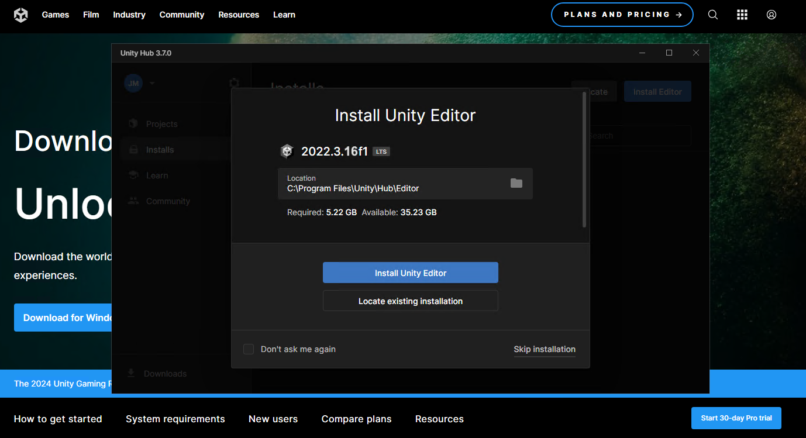
2. Antes de continuar, dirigase a la siguiente [página](https://unity.com/releases/editor/whats-new/2021.3.16) para instalar la versión correcta de Unity.

   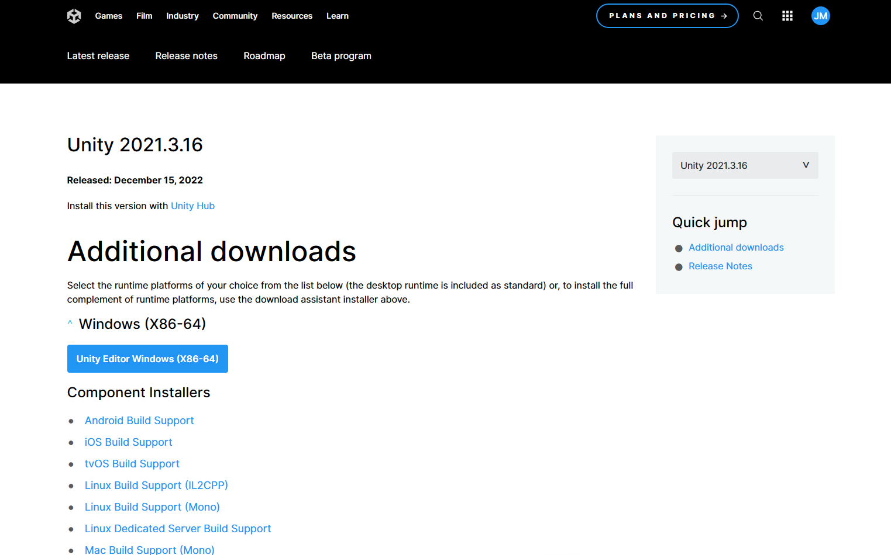
3. Basta con oprimir encima del texto azul **Unity Hub** para instalar la versión deseada. Esto lo llevará de nuevo a Unity Hub, pero con la versión 2021.3.16f1 LTS (Long Term Support).

   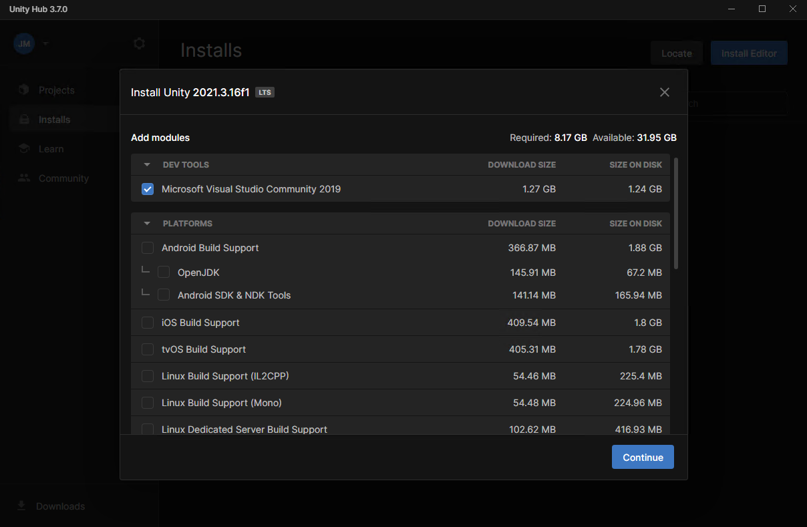
4. La ventana que se abrió se utiliza para instalar los módulos necesarios dentro de Unity. Los módulos son componentes que agregan funcionalidades específicas al Editor de Unity. Cada módulo se enfoca en una área particular del desarrollo de juegos y aplicaciones, y proporciona herramientas y funciones específicas para esa área. Por ejemplo, en nuestro caso es necesario instalar los módulos **Android Build Support** y **Windows Build Support (IL2CPP)**. Además, es necesario instalar una versión de **Microsoft Visual Studio** en caso de no contar con una. Esta versión debe ser del 2019 o posterior. Tomando en cuenta lo anterior, el la ventana debería verse así:

   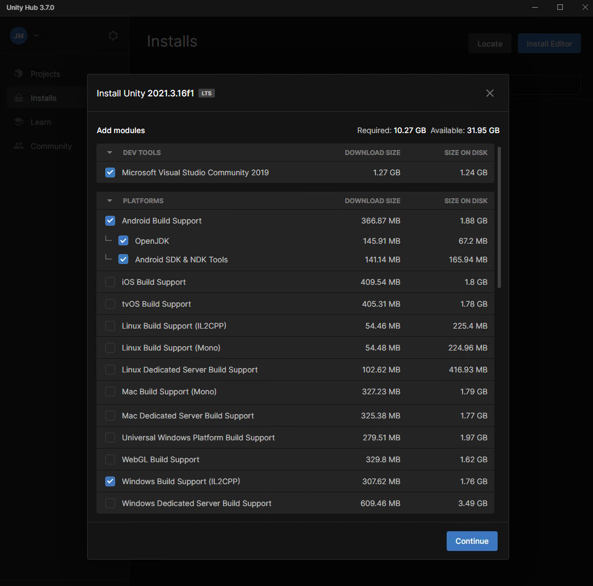
5. Lea y acepte los términos de condiciones establecidos por Google y Microsoft para instalar los módulos.

   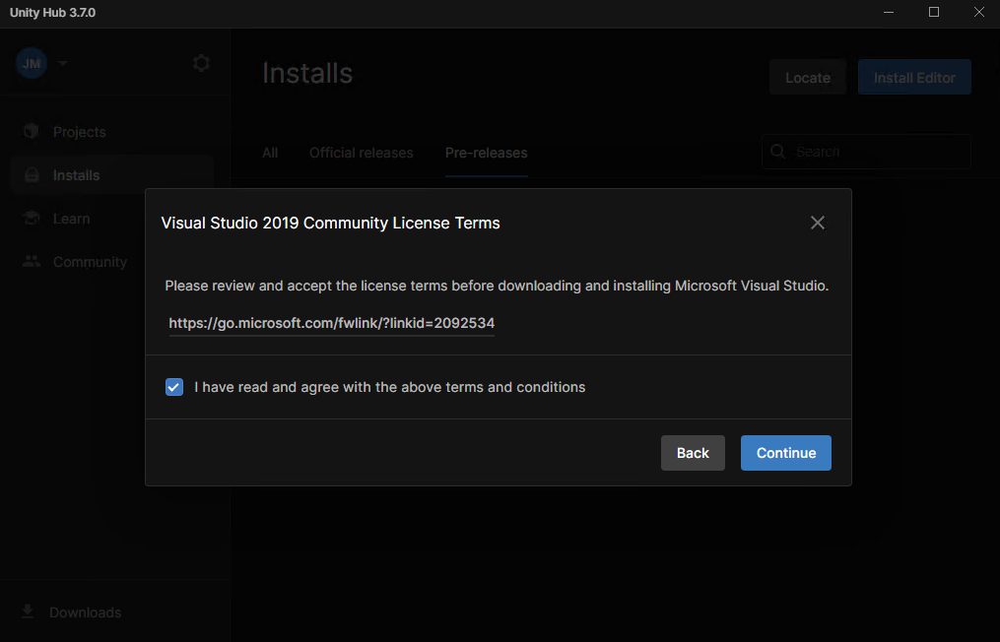
   
6. El proceso de instalación comenzará, este puede tardar algunos minutos. Por favor, espere a que termine completamente.

   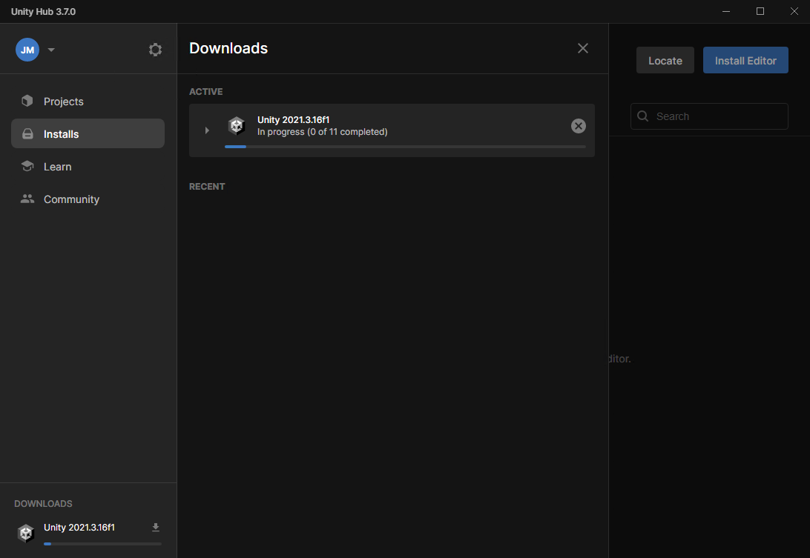
7. En caso de no contar con Microsoft Visual Studio con antelación, se abrirá el instalador de esta herramienta, por favor seleccione continuar. En este caso, es importante que agregue el componente **Desarrollo de juego con Unity** y seleccione el botón Instalar. Esto brindará las funciones básicas para manejar la compatibilidad entre Visual Studio y Unity.

   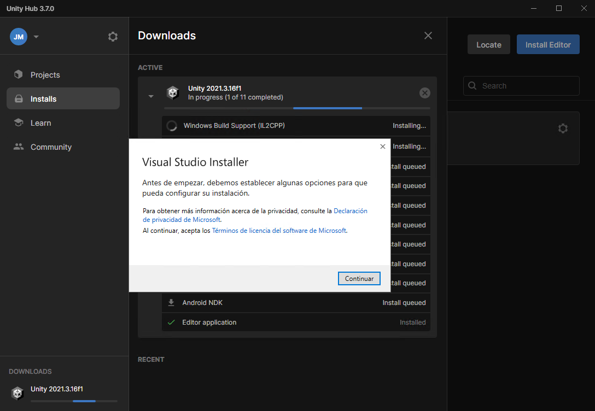
   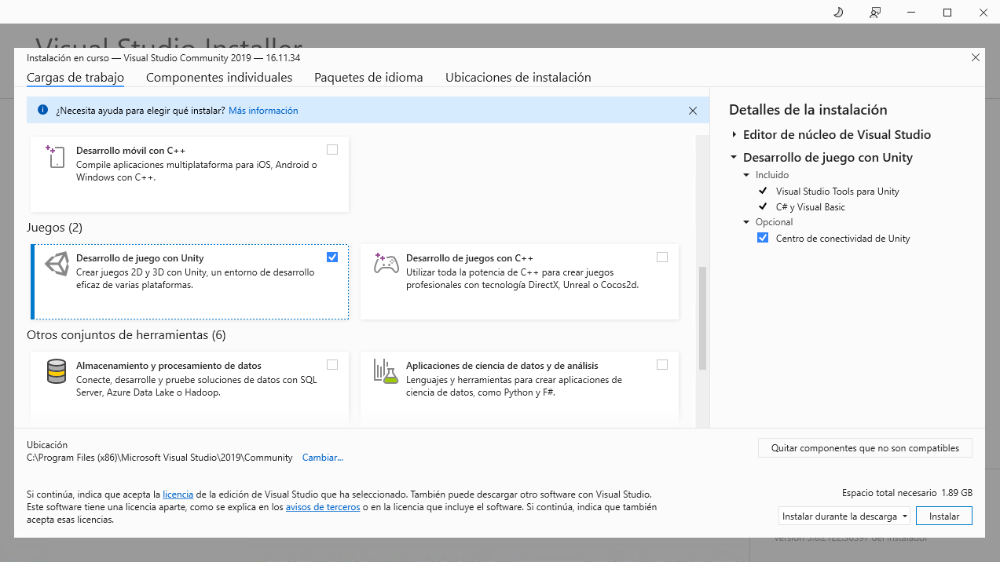
8. Al finalizar la instalación, la aplicación mostrará un aviso para iniciar sesión en Visual Studio. En caso de tener una cuenta, por favor inicie sesión. De lo contrario, puede seleccionar la opción **De momento, no; quizás más tarde**, ya que esto no afectará las acciones a realizar durante el curso.

   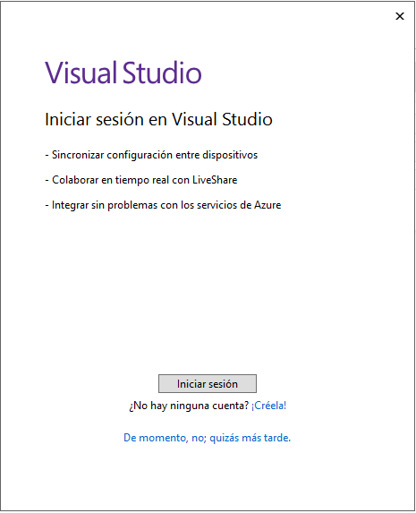
9. Por último, aseguresé de que la instalación del editor haya terminado. Recuerde no cerrar el programa, reiniciar o apagar su dispositivo hasta que este proceso haya finalizado.

   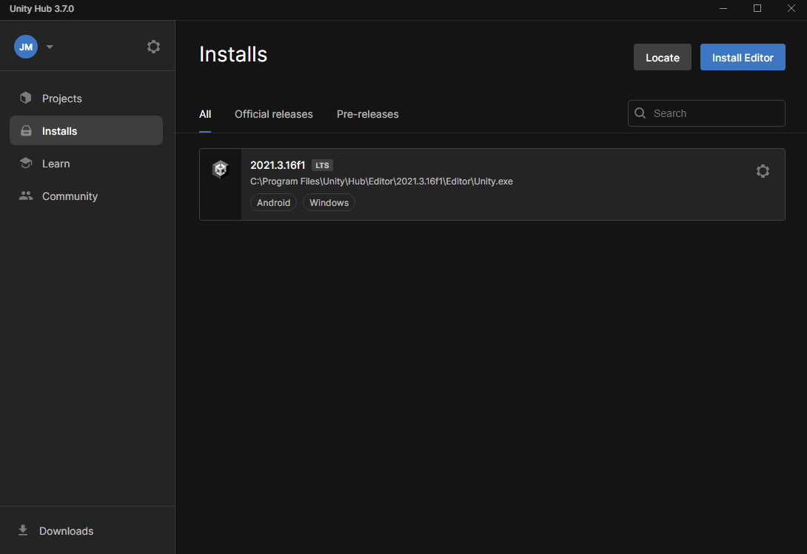

¡Felicidades! Al completar estos pasos el editor de Unity y todos sus complementos se han instalado satisfactoriamente. Es momento de continuar con el siguiente módulo.

**GRACIAS POR LLEGAR HASTA ACÁ, SI MEDISTE EL TIEMPO QUE UTILIZASTE, POR FAVOR TOMA NOTA DE ESTE Y REINICIA EL CRONÓMETRO. VUELVE A INICIAR EL TIEMPO PARA TENER UNA MEDIDA DE CUÁNTO TE DEMORAS EN REALIZAR EL RESTO DE LA GUÍA.**

## 3. Crear un nuevo proyecto

Duration: 0:05:00

Después de haber instalado el Editor de Unity y asegurarnos de que todas las configuraciones necesarias estén en su lugar, es el momento de crear un nuevo proyecto. Cada proyecto en Unity es único y puede tener ajustes específicos que lo diferencian de otros. Esto significa que podemos trabajar en proyectos que abarquen diferentes áreas, como 2D, 3D, Realidad Virtual, Realidad Aumentada, entre otros. En este caso, comenzaremos creando un proyecto en blanco en 3D, que luego adaptaremos para desarrollar en el entorno de Realidad Virtual.

1. Diríjase a la pestaña **Projects** y seleccione el botón azul con la etiqueta **New Project**.

   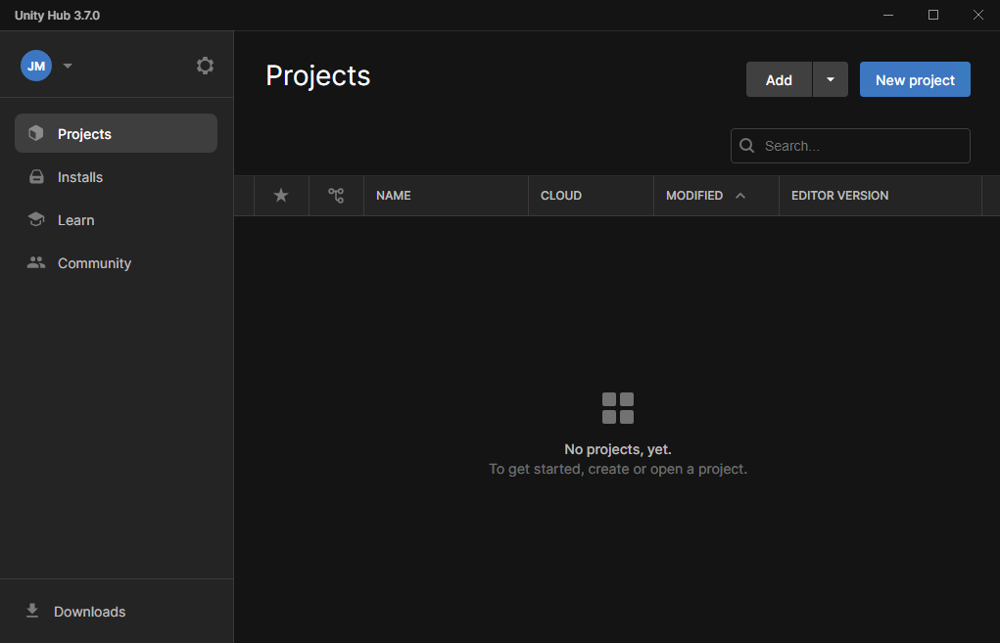
2. Dentro de la pestaña **All templates**, seleccione la opción **3D Core**. A la derecha de su ventana podrá ver una descripción del proyecto a crear, así como sus configuraciones iniciales. En la casilla **Project name** puede cambiar el nombre de su proyecto, es recomendable elegir un nombre creativo que haga alusión a este, por ejemplo **Primeros Pasos**. En la casilla **Location** seleccione la ruta donde desea alojar su proyecto. En caso de tener una máquina virtual asignada para el curso, debe ubicar y seleccionar su carpeta personal. Con respecto a las configuraciones de **Unity Cloud**, estas son opcionales y no son necesarias para el curso, por lo que las puede dejar en blanco. Estas son herramientas que permiten tener un mayor control de los proyectos a través de la nube de Unity y sistemas de control de versiones.

- Unity Cloud Organizations: Plataforma de Unity que proporciona herramientas de gestión y colaboración avanzadas para equipos de desarrollo, permitiendo una administración centralizada de proyectos, usuarios y recursos en la nube de Unity.
- Unity Cloud: Plataforma en la nube de Unity que ofrece servicios como análisis, publicidad, herramientas de colaboración y gestión de errores para desarrolladores de juegos y aplicaciones.
- Unity Version Control: Funcionalidad integrada en Unity que permite gestionar y controlar las versiones de los archivos del proyecto, facilitando la colaboración en equipo y la gestión eficiente de cambios

  Finalmente, haga click en el botón azul con la etiqueta **Create Project**.

  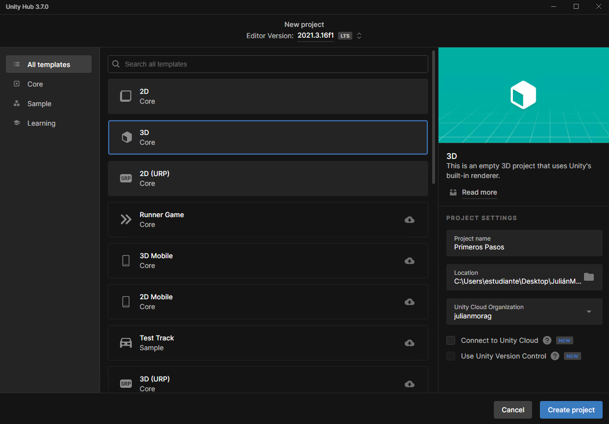

3. El proyecto se abrirá automáticamente. Es posible que reciba una notificación de Unity indicando que hay una versión más reciente de su editor. En este caso, le recomendamos seleccionar la opción **Skip new version** para mantener la coherencia y uniformidad en el entorno de desarrollo del curso. La elección de utilizar la versión **2021.3.16** del editor de Unity tiene como objetivo principal garantizar la consistencia entre todos los participantes, minimizando posibles discrepancias que puedan surgir debido a diferencias en las versiones del software y, por ende, facilitar un proceso de aprendizaje sin contratiempos ni incompatibilidades.

   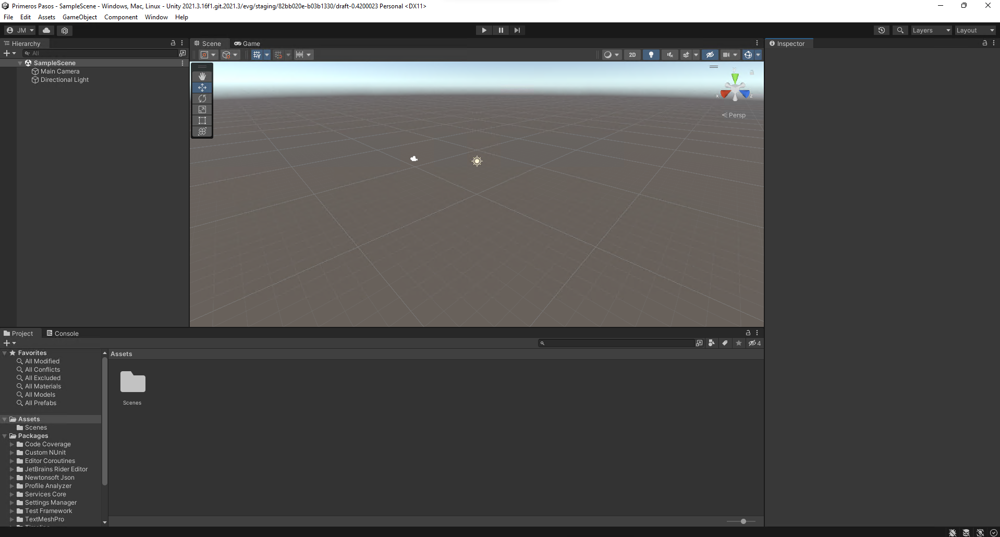

## 4. Configurar OpenXR dentro del proyecto

Duration: 0:10:00

Ahora que dispone de un proyecto 3D básico, es el momento de adaptarlo para desarrollar en Realidad Virtual para Meta Quest 1 y 2, utilizando OpenXR. Este estándar abierto y libre de regalías proporciona un acceso de alto rendimiento a las plataformas y dispositivos de Realidad Aumentada y Realidad Virtual.

Siga los pasos a continuación para configurar OpenXR en su proyecto.

1. En la parte superior izquierda de la ventana del editor, seleccione la pestaña **Edit** y **Project Settings**.

   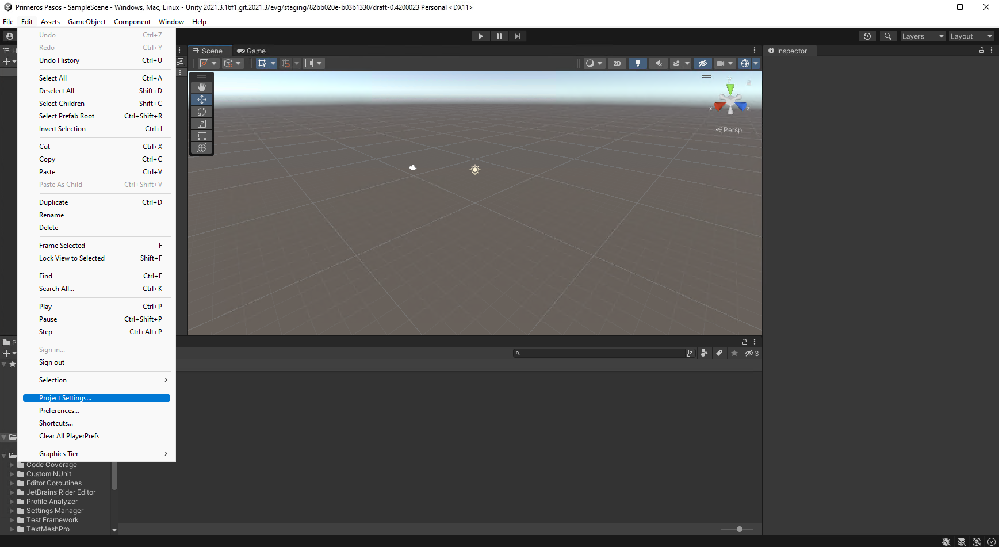
2. En la ventana emergente, seleccione **XR Plugin Management** en la parte inferior izquierda. Luego, haga click en **Install XR Plugin Management**.

   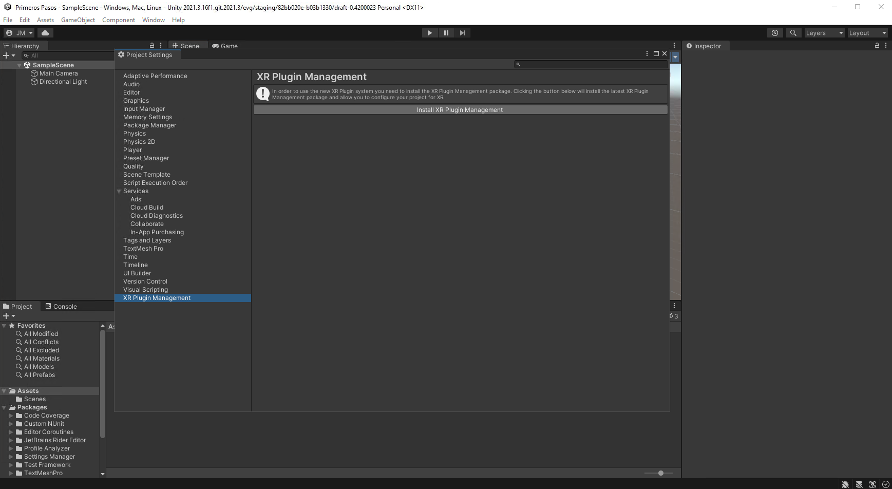
3. Ahora, seleccione **OpenXR** para instalar los paquetes necesarios. Al finalizar la instalación aparecerá una advertencia indicando que se debe reiniciar el editor para garantizar la compatibilidad entre este y los nuevos paquetes. Debe aceptar estos cambios dando click en **Yes**.

   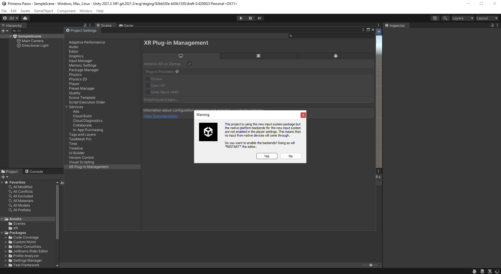
4. Después de que el editor de Unity haya recibido los cambios correctamente, podrá ver que hay un símbolo de advertencia al lado de OpenXR. Haga click encima de este y tome un momento para leer los mensajes. En la imagen a continuación podrá ver dos tipos de mensajes. Uno de ellos tiene un botón **Edit** a la derecha y el otro tiene un botón **Fix**. Generalmente, los mensajes que cuentan con el botón Fix son configuraciones que se pueden reparar con un simple click, por lo tanto, seleccione este botón para solucionar el problema. Por otro lado, el mensaje con el botón Edit indica que una o varias acciones deben ser realizadas, en este caso, añadir un perfil de interacción. Solucionaremos esta advertencia en el siguiente paso.

   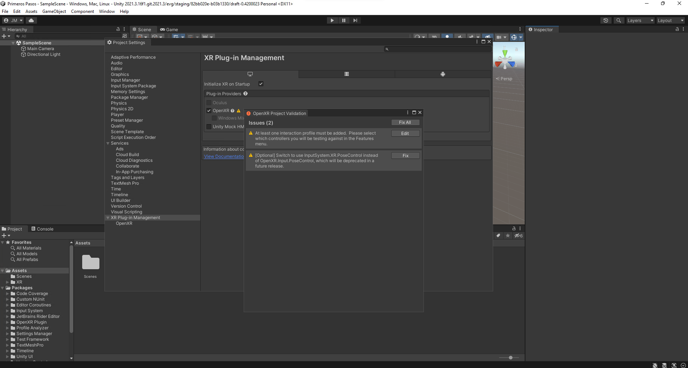
5. Para solucionar la advertencia anterior, debe dirijirse a la pestaña **OpenXR** en la parte inferior izquierda de la ventana. Asegurese de estar en las configuraciones para Windows, Linux y Mac, es decir, tener seleccionada la pestaña con el icono de un monitor 🖥️. Notará una lista vacía abajo de **Interaction Profiles**.  Haciendo click en el símbolo (+), seleccione **Oculus Touch Controller Profile**.

   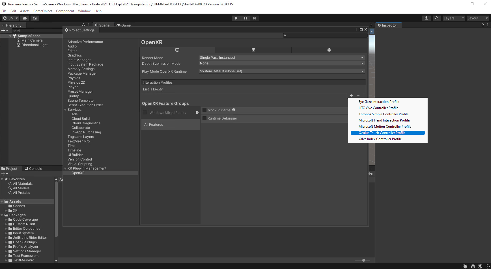
   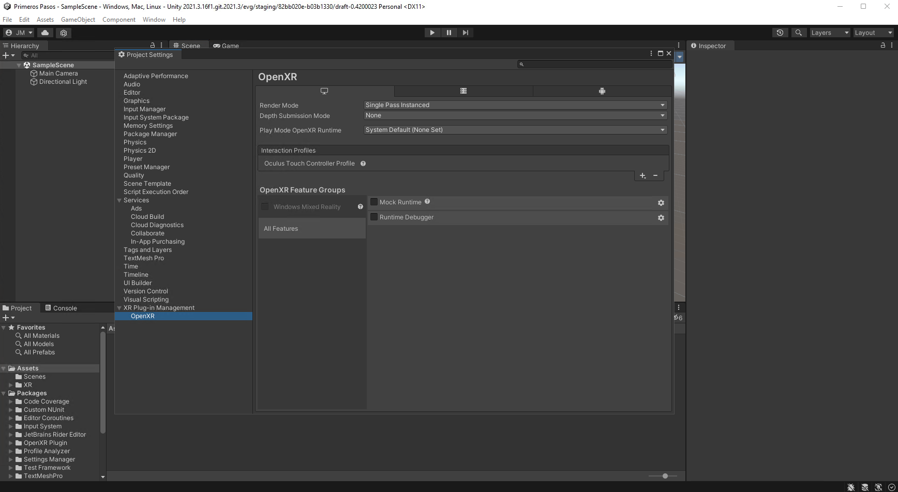
6. Ahora, seleccione la pestaña de Android en la parte superior derecha de la ventana OpenXR. Repita el paso 5 para añadir **Oculus Touch Controller Profile**. Además, seleccione la opción **Oculus Quest Support** dentro de OpenXR Feature groups. Finalmente, haciendo click en el icono de engranaje ⚙️ a la derecha de Oculus Quest Support, asegurese de tener seleccionadas las plataformas en las que va a desarrollar. Por motivos de este curso puede tener seleccionado Quest y Quest 2.

   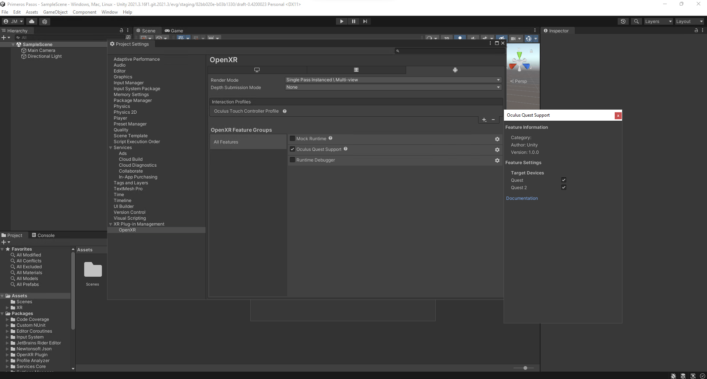

## 5. Instalar XR Interaction Toolkit

Duration: 0:10:00

Ahora que hemos configurado OpenXR en nuestro proyecto para el desarrollo de aplicaciones de realidad virtual destinadas a dispositivos Meta Quest, es crucial importar los paquetes necesarios dentro de Unity para poder desarrollar y probar nuestras experiencias de manera efectiva. En este módulo, nos centraremos en la instalación de XR Interaction Toolkit. Este es un paquete fundamental para facilitar el desarrollo y la implementación de nuestras experiencias de realidad virtual en dispositivos Meta Quest, asegurando una integración fluida y una experiencia inmersiva para los usuarios finales.

Siga los pasos a continuación para importar esta herramienta desde el manejador de paquetes de Unity.

1. Antes de empezar, diríjase a la pestaña **Package Manager** en la parte superior izquierda de la ventana Project Settings. Dentro de esta, seleccione Enable Pre-releases Packages. Al hacer esta acción, vamos a permitir que nuestro proyecto tenga acceso a futuras actualizaciones que se hagan para los paquetes a importar. Acepte los cambios dando click en **I Understand**.

   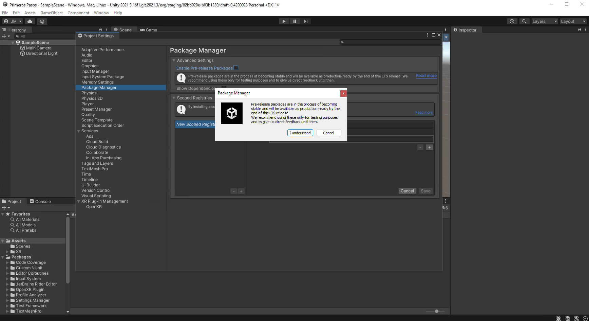
2. Cierre la ventana de Project Settings, navegue hacia la pestaña **Window**, en la parte superior del editor, y seleccione **Package Manager**.

   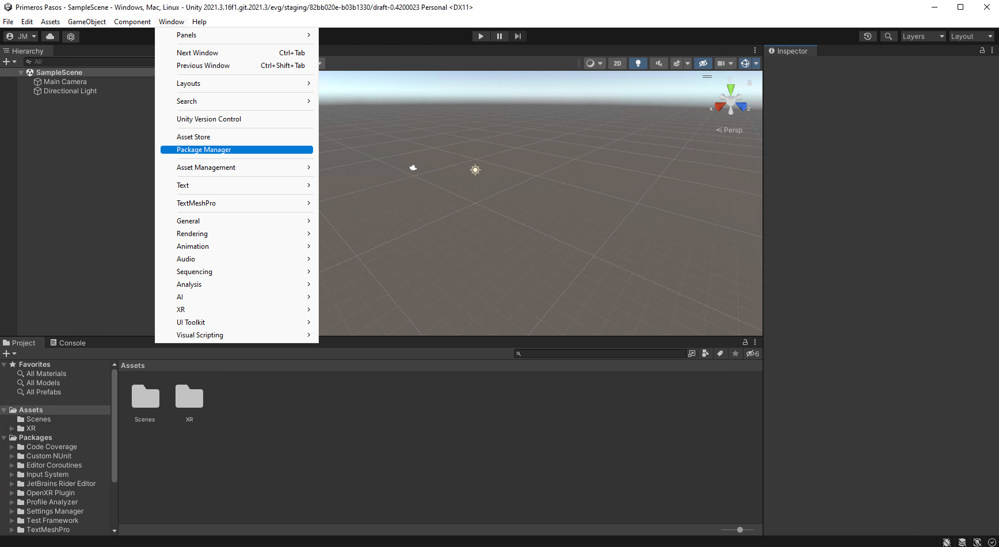
3. En la parte superior izquierda de la ventana emergente seleccione el símbolo (+) y oprima **Add package by name**.

   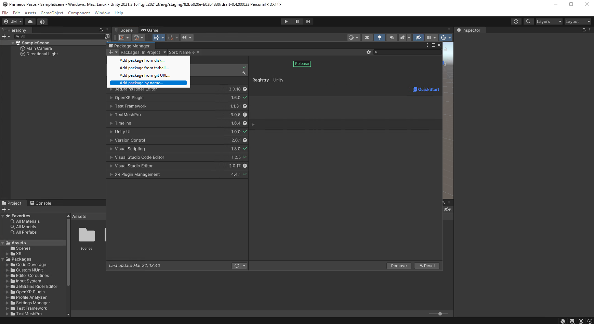
4. En la barra emergente debe escribir `com.unity.xr.interaction.toolkit` para instalar la última versión de **XR Interaction Toolkit**, seleccione el botón **Add** para confirmar la instalación.

   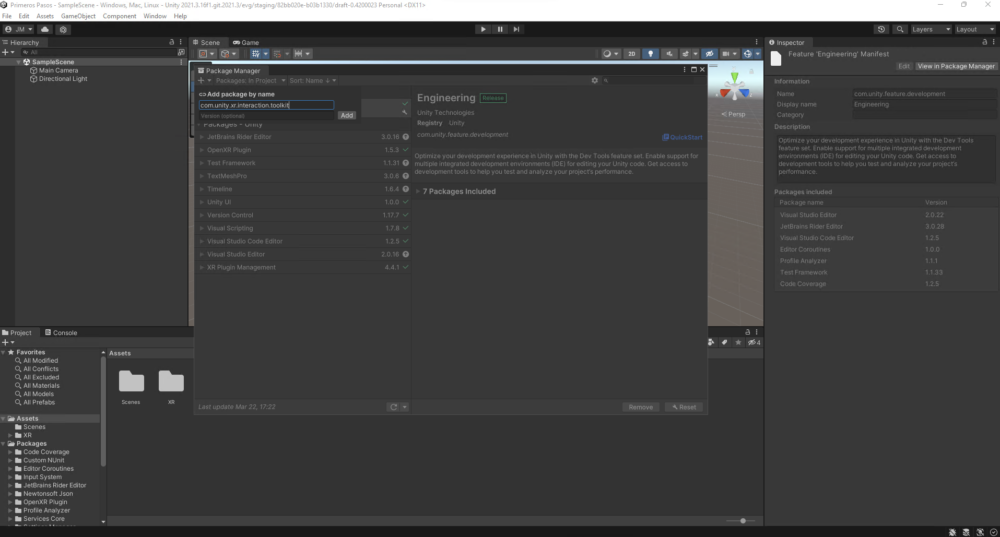
5. Al finalizar la instalación, puede que salga un dialogo informando que se deben realizar algunos cambios internos dentro de Unity para darle soporte a XR Interaction Toolkit. Como este es un proyecto nuevo, permita que Unity realice los ajustes necesarios haciendo click en **I Made a Backup, Go Ahead!**. Si no recibió este anuncio, puede omitir este paso.

   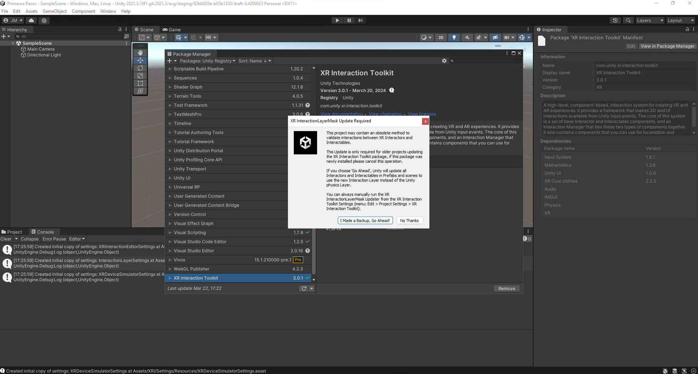
6. Cuando Unity termine de realizar los cambios, es necesario importar **Starter Assets** y **XR Device Simulator**. Podrá encontrarlos debajo de Samples en la ventana XR Interaction Toolkit. Seleccione el botón **Import** en ambos casos. En caso de presenar errores, se abrirá la ventana de validación del proyecto. Basta con oprimir en **Fix All** para indicarle a Unity que solucione estos problemas automáticamente.

   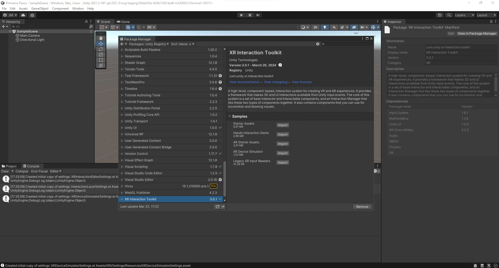
   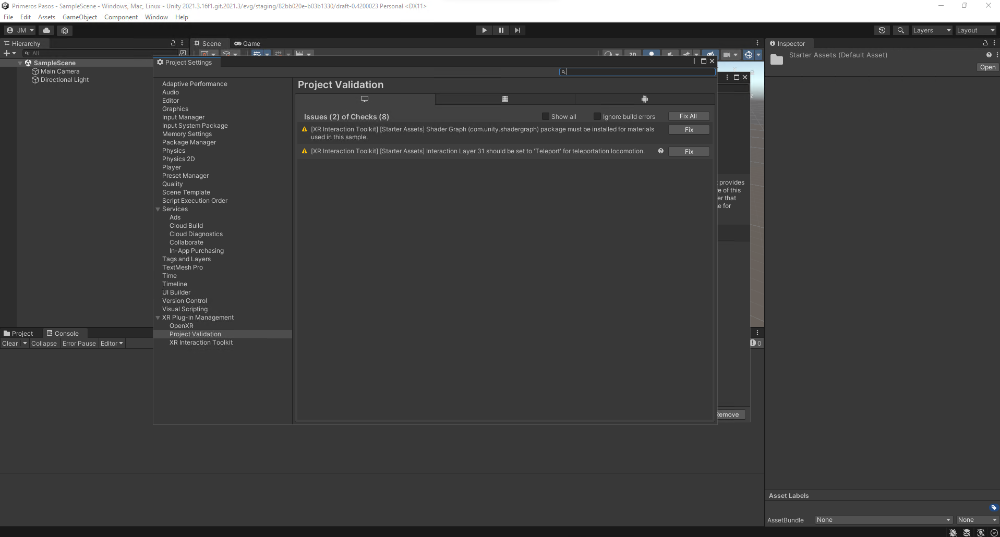
7. En este punto, ya puede cerrar la ventana Package Manager. Ahora, en la parte inferior del editor, ubique la pestaña **Project** y seleccione el prefab llamado **XR Origin (XR Rig)**. Podrá encontrar este prefab siguiendo la ruta: Assets - Samples - XR Interaction Toolkit - 3.0.1 (su versión) - Starter Assets - Prefabs.

   
8. Añada el prefab a la escena arrastrandolo como se indica en la siguiente imagen:

   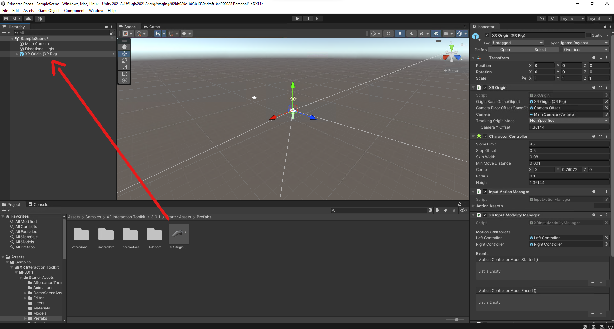
9. Repita los pasos anteriores para ubicar y añadir el prefab llamado **XR Device Simulator**. Podrá encontrar este prefab siguiendo la ruta: Assets - Samples - XR Interaction Toolkit - 3.0.1 (su versión) - XR Device Simulator

   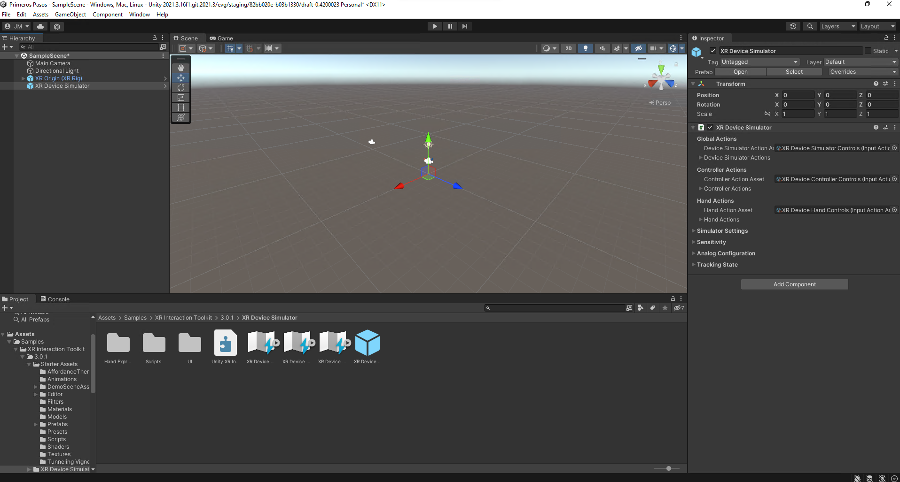
10. El prefab Complete XR Origin Set Up tiene una cámara adjunta, así como la noción de controles para realidad virtual. Por lo tanto, **elimine** el objeto **Main Camera** de su escena, haciendo click derecho y seleccionando Delete.

    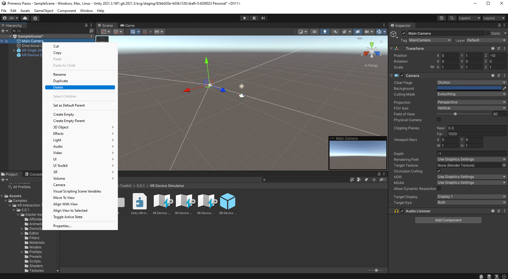
11. Verifique que las instalaciones se hayan realizado correctamente dando click en el botón **play** (▶️), puede encontrarlo en la parte superior del editor, justo en el centro. Al seleccionar este botón se va abrirá la vista de juego, usted debería ver algo similar a la siguiente imagen:

    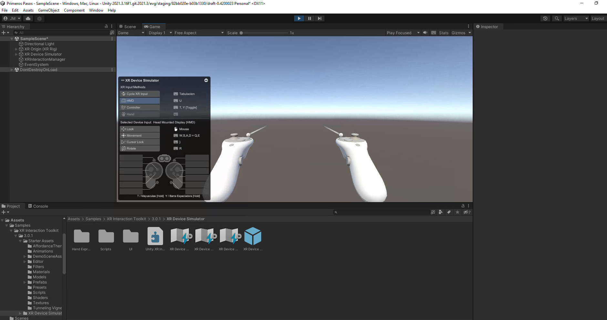

¡Enhorabuena! Con estos pasos completados, ya tendrá todas las configuraciones necesarias dentro de Unity para desarrollar aplicaciones de realidad virtual.
En el siguiente módulo enseñaremos un ejemplo básico sobre cómo realizar pruebas de interacción.

**GRACIAS POR TERMINAR LA GUÍA. POR FAVOR, ANOTA EL TIEMPO QUE TE DEMORASTE DESDE EL APARTADO 3 (CREAR UN PROYECTO 3D) HASTA ESTE PUNTO. COMPARTE EL TIEMPO UTILIZADO PARA AMBAS PARTES A TRAVÉS DE NUESTRO GRUPO DE WHATSAPP, POR FAVOR.**

